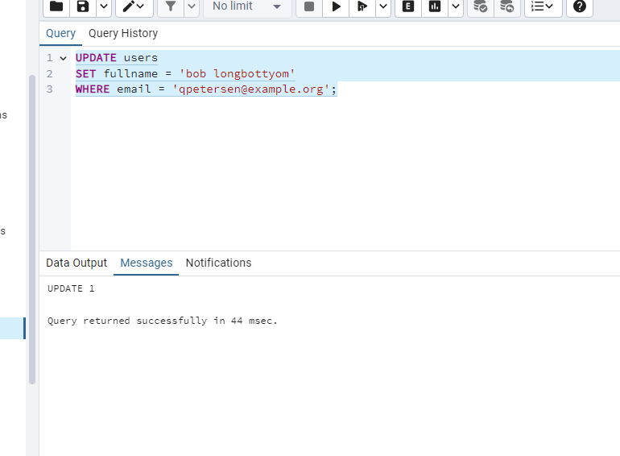

- **Отримати всі завдання певного користувача.** Використайте `SELECT` для отримання завдань конкретного користувача за його `user_id`.

``` sql
select * from public.tasks
	where user_id = 101
```


- **Вибрати завдання за певним статусом.** Використайте підзапит для вибору завдань з конкретним статусом, наприклад, `'new'`.

```sql 
select * from public.tasks
	where status_id = (
	select id from public.status
	where name = 'in progress'
	)

```


- **Оновити статус конкретного завдання.** Змініть статус конкретного завдання на `'in progress'` або інший статус.
  

```sql

update public.tasks
set status_id = (
	select id from public.status
	where name = 'new'
	)
where id = 621

```


- **Отримати список користувачів, які не мають жодного завдання.** Використайте комбінацію `SELECT`, `WHERE NOT IN` і підзапит.

```sql

select * from public.users
where id not in (
	select user_id from public.tasks
)

```


- **Додати нове завдання для конкретного користувача.** Використайте `INSERT` для додавання нового завдання.

```sql

INSERT INTO tasks (title, description, status_id, user_id) 
	VALUES ('New task', 'Description', 4, 124)
```


- **Отримати всі завдання, які ще не завершено.** Виберіть завдання, чий статус не є 'завершено'.

```sql
select * from public.tasks
where status_id in (select id from public.status
	where name <> 'completed'
	)
```


- **Видалити конкретне завдання.** Використайте `DELETE` для видалення завдання за його `id`.

```sql
delete from public.tasks
where id = 615
	
```


- **Знайти користувачів з певною електронною поштою.** Використайте `SELECT` із умовою `LIKE` для фільтрації за електронною поштою.
  
```sql

SELECT * FROM users
WHERE email LIKE '%ter%@example.org%';

```


- **Оновити ім'я користувача.** Змініть ім'я користувача за допомогою `UPDATE`.

```sql

UPDATE users
SET fullname = 'bob longbottyom'
WHERE email = 'qpetersen@example.org';
```



- **Отримати кількість завдань для кожного статусу.** Використайте `SELECT`, `COUNT`, `GROUP BY` для групування завдань за статусами.

```sql
SELECT status.name, COUNT(tasks.id) as task_count
FROM tasks
JOIN status ON tasks.status_id = status.id
GROUP BY status.name;
```


- **Отримати завдання, які призначені користувачам з певною доменною частиною електронної пошти.** Використайте `SELECT` з умовою `LIKE` в поєднанні з `JOIN`, щоб вибрати завдання, призначені користувачам, чия електронна пошта містить певний домен (наприклад, `'%@example.com'`).


```sql
SELECT tasks.*
FROM tasks
JOIN users ON tasks.user_id = users.id
WHERE users.email LIKE '%@example.com';

```


- **Отримати список завдань, що не мають опису.** Виберіть завдання, у яких відсутній опис.


```sql
SELECT * FROM tasks
WHERE description IS NULL OR description = '';

```


- **Вибрати користувачів та їхні завдання, які є у статусі** `'in progress'`**.** Використайте `INNER JOIN` для отримання списку користувачів та їхніх завдань із певним статусом.

```sql

SELECT users.fullname, tasks.title, tasks.description
FROM users
JOIN tasks ON users.id = tasks.user_id
JOIN status ON tasks.status_id = status.id
WHERE status.name = 'in progress';

```


- **Отримати користувачів та кількість їхніх завдань.** Використайте `LEFT JOIN` та `GROUP BY` для вибору користувачів та підрахунку їхніх завдань.

```sql

SELECT users.fullname, COUNT(tasks.id) as task_count
FROM users
LEFT JOIN tasks ON users.id = tasks.user_id
GROUP BY users.fullname;

```

